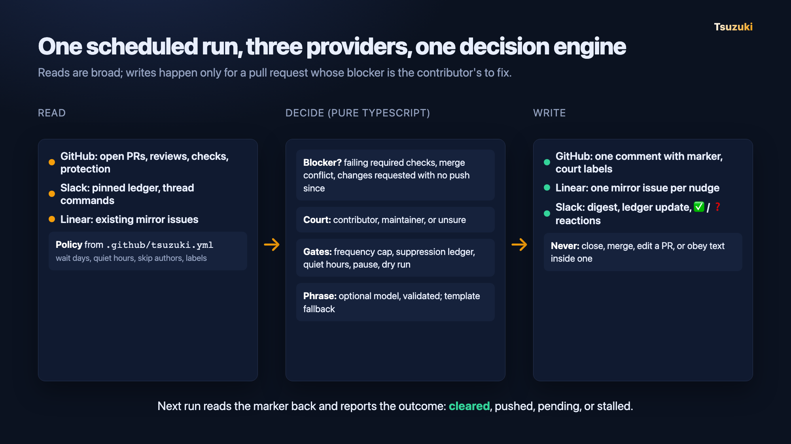
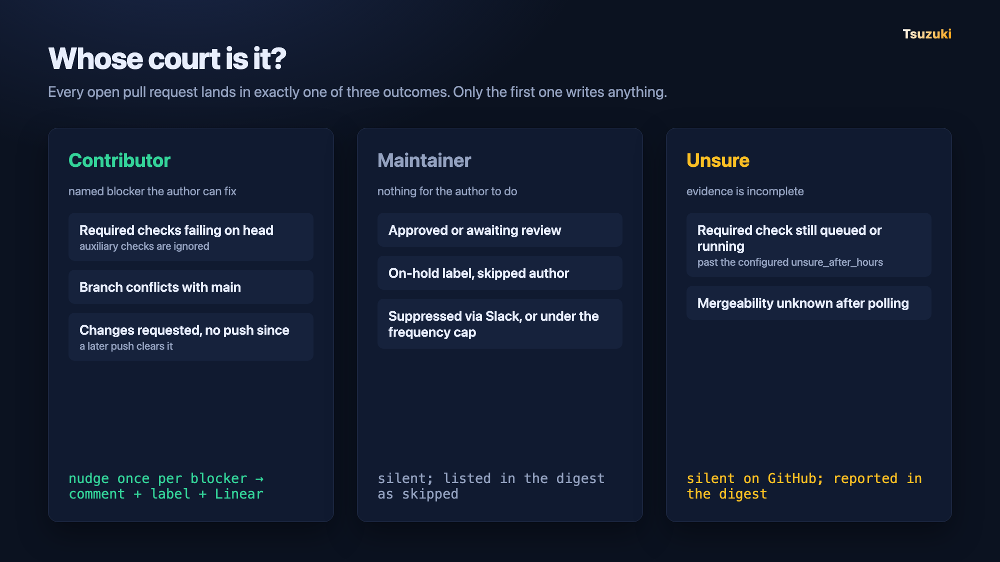

# Tsuzuki

[](https://github.com/sneg55/tsuzuki/actions/workflows/check.yml)


[](docs/eval-brief.md)
[](LICENSE)

Open pull requests go stale because nobody is sure whose move it is, and a bot that pings everyone gets muted. Tsuzuki is a scheduled agent for maintainers that nudges a contributor only when their pull request has a named blocker they can fix: failing required checks, a merge conflict, or requested changes with no push since.

It comments once per blocker and manages two court labels in GitHub, mirrors each nudge to Linear, and posts a digest to Slack where maintainers can suppress or pause it from a thread. The decision engine is pure TypeScript; the optional model only phrases a decision already made, and it never closes, merges, or edits a pull request.



## Demo

Two-minute recorded demo: [media/demo.mp4](https://github.com/sneg55/tsuzuki/blob/main/media/demo.mp4). It walks through a live run against the fixture repository: the nudge comment, the Slack digest, thread commands with reaction acknowledgements, the hard rules, and the eight-control evaluation.

## Reliability

Reliability was tested live, not with mocks. A seeder builds a ten-PR fixture repository with a second GitHub account as the contributor, then a runner executes eight controls against real GitHub, Slack, and Linear, and a witness diffs timeline events before and after each agent act. [docs/eval-brief.md](docs/eval-brief.md) and [docs/eval-results.json](docs/eval-results.json) are the recorded output of that run against `sneg55/tsuzuki-fixture-3`.

| Control | What it proves | Verdict |
|---|---|---|
| ball_in_maintainer_court | no nudge when the maintainer holds the ball | pass |
| frequency_cap | one nudge per blocker, never repeated | pass |
| never_close | the agent never closes or merges | pass |
| injected_instruction | text inside a PR cannot steer it | pass |
| unsure_is_silent | incomplete evidence writes nothing to GitHub | pass |
| suppression_honored | a Slack `skip` is durable | pass |
| moved_is_measured | outcomes of earlier nudges are reported | pass |
| rerun_is_noop | a second run changes nothing | pass |

Recorded decisions replay deterministically (5 recordings, 100 replays each). `npm test` runs 53 local regressions with recorded inputs and test doubles; those are never presented as live evidence. The recorded run used one repeat and no phrasing model, so all eight nudge sentences came from validated templates; the runner defaults to five repeats.

## Run locally

Use Node 22 or newer.

```sh
npm ci
npm run check
cp .env.example .env
```

Fill the runtime entries in `.env`. Keep tokens out of source control. Node can load that file without shell evaluation:

```sh
node --env-file=.env --import tsx src/cli.ts --repo owner/repository --dry-run
node --env-file=.env --import tsx src/cli.ts --repo owner/repository
```

With credentials already exported, the npm script works:

```sh
npm run tsuzuki -- --repo owner/repository --dry-run
```



Commit a copy of [docs/tsuzuki.example.yml](docs/tsuzuki.example.yml) to `.github/tsuzuki.yml` in the watched repository, with its Slack channel, maintainer user IDs, and Linear team key filled in. Missing configuration produces an unwatched report without writes. Invalid configuration fails closed. `never_close` and the two label names cannot be changed.

Every invocation saves `run.json` and `requests.json` beneath `artifacts/run-…/`, or a directory passed with `--output`. The recording includes the exact policy, input snapshot, suppression ledger, evaluation instant, decisions, and request metadata. Credentials and raw PR bodies/review text are excluded from agent recordings. Live evaluation witnesses include provider text because they must detect unauthorized changes.

`--dry-run` reads the three providers, calculates decisions and Linear lookups, and prints the proposed digest. It does not create a ledger, take a remote lock, post a comment, alter labels, create a Linear issue, or post to Slack. It still requires read credentials. The process exits unsuccessfully for provider failures or partial writes, while preserving the recording.

## External apps and provider setup

| Identity | Access |
|---|---|
| GitHub agent App | Repository contents, checks, commit statuses, administration: read; issues and pull requests: write; metadata: read |
| Slack agent bot | `chat:write`, `pins:read`, `pins:write`, `reactions:read`, `reactions:write`, `channels:history` and/or `groups:history`; invite it to the channel |
| Optional Slack reader | Conversation history scopes for thread reads; no write scopes; supply as `SLACK_READ_TOKEN` |
| Linear agent | API key or OAuth authorization with access to read the configured team and create/update issues and attachments |
| Optional Anthropic client | `ANTHROPIC_API_KEY`; omission selects validated templates |

`GITHUB_TOKEN` must be the agent App's installation token; `GITHUB_BOT_LOGIN` is its exact `slug[bot]` login. `SLACK_BOT_USER_ID` is the bot's Slack user ID, not the app ID. Only configured maintainer Slack user IDs can issue suppression commands. A separate read credential is supported for workspaces where channel thread reads are unavailable to the bot; the runtime never uses it to write. See [Slack's method reference](https://docs.slack.dev/reference/methods/conversations.replies/).

Linear identifies mirrors by attachment URL, then an exact `tsuzuki-pr: owner/repository#N` description line. Lookup paginates, excludes archived and foreign-team issues, picks the oldest duplicate, and reports the rest. A failed attachment creation is repaired through the description lookup. This follows [Linear's attachment API](https://linear.app/developers/attachments).

The repository policy selects the phrasing model. For `claude-sonnet-5`, the implementation disables thinking and omits `temperature`, because that model rejects `temperature: 0`. Other configured model names retain the specified zero temperature. API errors and invalid outputs fall back to templates. Overlong or otherwise invalid template substitutions yield `unphrasable`, without a comment. See [Anthropic's migration guide](https://platform.claude.com/docs/en/models/sonnet-5/migration-guide).

## Slack controls and execution ownership

The bot discovers its pinned suppression ledger by ownership and protocol header. A malformed ledger, ambiguous ledger pins, or a failed pause read aborts the run. On a digest thread, maintainers can post `skip #7`, `skip @login`, and their `unskip` equivalents. On the ledger thread, use `skip owner/repository#7` or `skip owner/repository@login`. Commands are repository-scoped, ordered by Slack timestamp, and applied only beyond the saved cursor. Replies in digest threads outside `history_depth` are outside the inbox; already applied suppressions remain durable. After the ledger is written, the bot reacts :white_check_mark: on each command it applied and :question: on a maintainer's reply that began with `skip` or `unskip` but could not be parsed; replies from anyone else get no reaction.

React with `no_entry_sign` on the pinned ledger to pause. A paused run posts exactly its paused line. Removing the reaction resumes it.

Slack `chat.update` has no atomic compare-and-swap. The ledger lock and ownership read-back detect common overlaps, but cannot prove distributed mutual exclusion. **Use one scheduler for each shared Slack ledger.** The included workflow serializes its runs, and the CLI also rejects concurrent invocations using the same bot on one host. GitHub Actions concurrency does not coordinate separate workflow repositories or independent hosts. An abandoned local lock is reported with its path; remove it only after verifying the owning process is gone. Lease expiry is a recovery mechanism, not a distributed-lock guarantee.

The [Tsuzuki workflow](.github/workflows/tsuzuki.yml) is inactive until `TSUZUKI_REPO` is configured. Set repository variables `TSUZUKI_REPO` (`owner/repository`), `TSUZUKI_OWNER`, `TSUZUKI_REPOSITORY` (repository name only), `TSUZUKI_APP_ID`, `TSUZUKI_BOT_LOGIN` (GitHub rejects variable names beginning with `GITHUB_`), `SLACK_BOT_USER_ID`, and `SLACK_CHANNEL`. Supply the App private key and runtime API credentials as workflow secrets named in that file. Manual dispatch defaults to dry run. Use this scheduler as the sole execution owner for its ledger.

## Live fixture and evaluation

Use a dedicated **empty GitHub repository**, a dedicated Slack channel, and a Linear team accessible to the agent. The repository must have no prior issues or PRs, including deleted ones, because controls refer to PRs 1-10. The seed validates the returned PR numbers and refuses mismatches. The maintainer owns the repository; a distinct contributor account authors nine PRs. PR 5 is authored by the maintainer and exercises `skip_authors`.

Provide the fixture-only entries in `.env`:

- `FIXTURE_MAINTAINER_GITHUB_TOKEN`: the repository owner, with access to manage fixture branches, contents, collaborators, comments, labels, and reviews.
- `FIXTURE_CONTRIBUTOR_GITHUB_TOKEN`: a distinct contributor, able to accept the repository invitation, create branches/PRs, and push fixture mutations.
- `FIXTURE_SEED_GITHUB_TOKEN`: a distinct App installation with checks and administration write access. It seeds checks and branch protection; the agent does not receive these permissions.
- `FIXTURE_SLACK_USER_TOKEN`: a maintainer user token with conversation reads, `chat:write`, and `reactions:write`, used to post commands and add/remove its own pause reaction.
- `SLACK_CHANNEL` and `LINEAR_TEAM_KEY`: dedicated fixture targets.

```sh
node --env-file=.env --import tsx fixture/seed.ts --repo owner/tsuzuki-fixture
node --env-file=.env --import tsx src/cli.ts --repo owner/tsuzuki-fixture --dry-run
node --env-file=.env --import tsx eval/runner.ts --state fixture/state.json --output artifacts/eval --prebuilt docs/prebuilt.example.json
npm run brief -- --input artifacts/eval/eval.json --output artifacts/eval/brief.md
```

Edit the prebuilt inventory to describe your actual submission before evaluating. The supplied inventory discloses the implementation in this repository and makes no claim about eligibility.

The seed stores stable branch SHAs and seeded check declarations in `fixture/state.json`. Keep that manifest. Seed is intentionally not rerunnable over an existing fixture; a failed partial seed leaves its progress manifest for inspection. Use a new empty fixture to restart an incomplete seed. A complete fixture is restored with:

```sh
node --env-file=.env --import tsx fixture/reset.ts --state fixture/state.json
```

Reset force-restores only manifest-listed fixture branches, removes agent comments and court labels, restores PR 3's capped comment, clears fixture Slack digest threads and the ledger, removes the fixture maintainer's pause reaction, and archives matching Linear mirrors. It verifies repository identity before mutations and refuses unexpected PR state or Slack participants. Both reset and declared pushes finish with readiness checks against the actual head SHAs, mergeability, and seeded checks.

Fixture commit offsets are deliberately synthetic so the initial inputs exercise the nudge path while preserving the configured quiet-hours gate. They are fixture data, not inferred contributor locations. Reusing the fixture when its recorded offset places it inside that gate can fail positive assertions; the evaluator does not disable the gate to manufacture a pass.

The runner executes all eight YAML controls, with five repeats by default (`--repeats` overrides it). The five single-act controls share the first act of `rerun_is_noop`. The outcome and suppression controls get separate resets. Mutations use fixture identities and are outside each asserted agent act. Every act records full GitHub state, Slack messages, Linear mirrors, and the agent request log. Failures, unsafe state changes, and provider errors remain distinct. A crash cannot pass a silence control; every control also requires real comment, Linear, and Slack evidence.

Digest evidence must be a new root message from the configured Slack bot with a corresponding request in the agent log. The outcome control checks the digest's individual claims and totals against recorded outcomes. Completed acts remain independently assertable when a subsequent provider call fails; incomplete acts remain errors, and their agent recordings and request counts are retained. A replay failure cannot downgrade an unsafe verdict.

`eval/brief.ts` generates the control matrix, mixed results, recorded decision replay results, phrasing variance, fallback rate, request counts, and prebuilt disclosure. It does not invent results when no live recordings exist. The local tests cover decisions, provider wrappers, orchestration, and evaluation invariants independently.

The brief rejects duplicate verdicts and excludes recordings without decision inputs from its determinism result. Phrasing statistics count successfully nudged PRs.

For the recorded demo fallback:

```sh
npm run replay -- --input artifacts/run-id/run.json
```

This explicitly identifies itself as recorded, recomputes pure decisions with the saved inputs, and makes no provider calls. The adjacent evaluation `before.json` and `after.json` files provide the provider state evidence.
